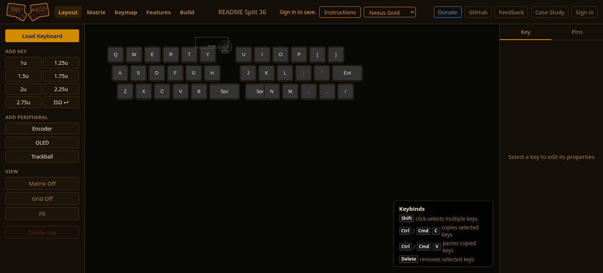
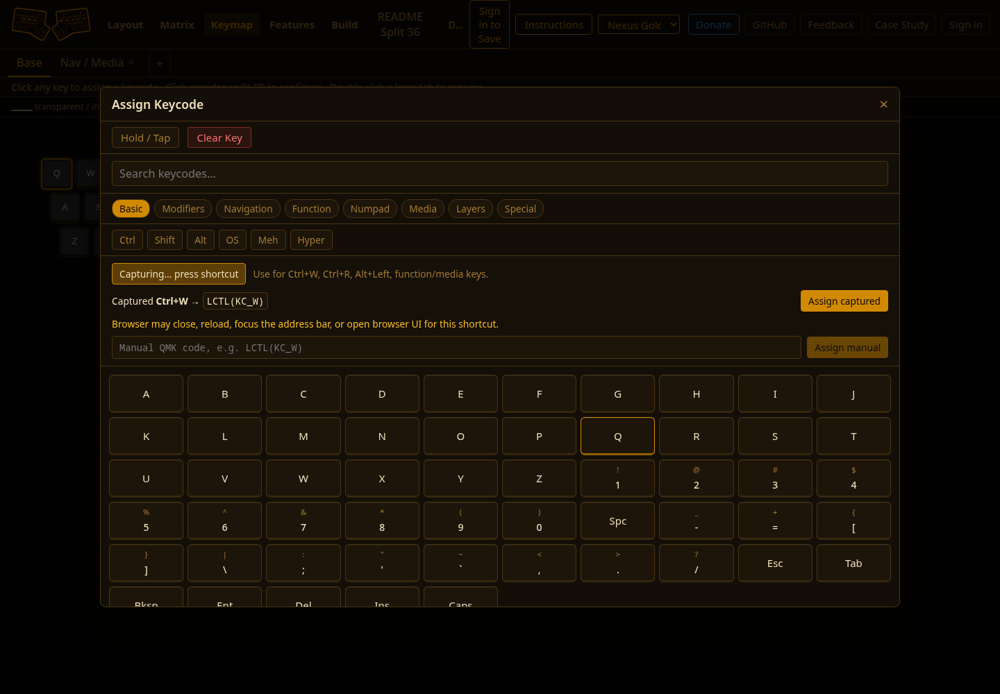
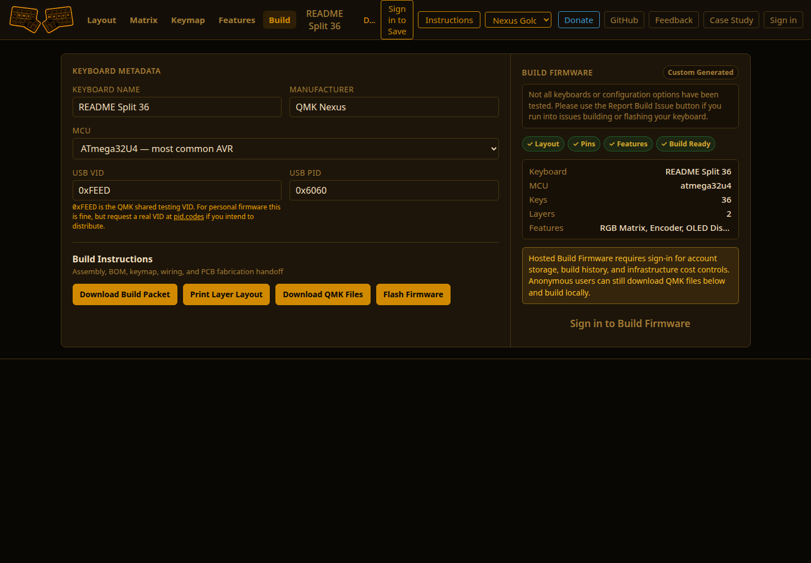

# QMK Nexus

QMK Nexus is a browser-based firmware builder for custom QMK keyboards. It helps users design layouts, wire matrix rows and columns, assign keymaps, configure hardware features, and build firmware from one visual workflow.

## Try It

- Live app: https://qmknexus.tebay.dev
- Project writeup: https://tebay.dev/projects/qmknexus.html
- Feedback/issues: https://github.com/nathan-tebay/qmk-nexus/issues

## Project Status

QMK Nexus is an active work in progress. It supports visual layout editing, matrix wiring, keymap layers, feature configuration, QMK keyboard imports, and firmware builds.

Feedback from custom keyboard builders is welcome.

## Screenshots

### 1. Design the keyboard layout



### 2. Map keys and features



### 3. Build and download firmware



## What It Is

QMK Nexus replaces the QMK Python toolchain with a purpose-built web application. It generates standards-compliant QMK source files and compiles them using vendored AVR and ARM toolchains inside a container. No local QMK installation required.

You can also import existing keyboards from the QMK keyboard index to use as a starting point.

## Who This Is For

QMK Nexus is for:

- builders creating hand-wired or custom QMK keyboards
- users adapting existing QMK-supported keyboards
- keyboard hobbyists who want visual tools instead of hand-editing config files
- developers interested in firmware tooling, visual editors, and browser-based build workflows

## Core Workflow

```text
Layout + Wiring → Keymap / Layers → Features + Build
```

1. **Layout + Wiring**: Draw your keyboard on a canvas. Assign matrix rows and columns by drawing edges between keys. Map MCU pins. Place encoders, OLEDs, and trackballs.
2. **Keymap / Layers**: Click any key to assign a keycode. Manage layers. Configure encoder actions per layer. Set up OLED display content.
3. **Features + Build**: Toggle QMK feature modules such as RGB, split, tap-dance, and combo keys. Set USB metadata, pick your MCU, compile, and download the `.hex` or `.bin` file.

## Feedback Wanted

The most useful feedback right now:

- keyboards that do not import correctly
- confusing parts of the matrix wiring workflow
- browser or OS shortcut conflicts
- QMK features that should be supported next
- build failures with specific MCUs or keyboard types

Please open feedback at https://github.com/nathan-tebay/qmk-nexus/issues.

## Features

- **Visual layout editor**: drag, resize, rotate keys; ISO-enter shape support; multi-select with transform
- **Matrix wiring**: draw row/col/LED edges between keys; row/col indices auto-derived via Union-Find
- **Peripheral support**: encoders, OLED displays, trackballs with per-peripheral configuration
- **Full keycode library**: complete QMK keycode set, categorized
- **Layer management**: unlimited layers, rename, reorder
- **OLED configurator**: preset content blocks (layer name, WPM, mod indicators, logo) or custom C code
- **15 feature modules**: RGB Matrix, RGB Light, Backlight, Split Keyboard, Encoder, OLED, Pointing Device, Tap Dance, Combo Keys, Mouse Keys, NKRO, Boot Magic, Console, Extra Keys, Audio
- **QMK keyboard import**: search 1000+ keyboards from the QMK index; import layout, matrix, default keymap
- **QMK-native builds**: for boards that need upstream QMK source files overlaid (ErgoDox, HotDox, etc.)
- **Live build log**: poll build status every 2s; stream compiler output; one-click download
- **Custom source overrides**: upload your own `config.h`, `keyboard.c`, etc. to override generated files
- **Per-user storage**: all keyboards saved to your account; up to 20 keyboards per user

## Supported MCUs

Generated build path: `atmega32u4`, `atmega32u2`, `at90usb1286`, `atmega328p`, `stm32f072`, `stm32f103`, `stm32f303`, `mk20dx256`, `rp2040`

QMK-native build path: any MCU supported by upstream QMK

## Stack

| Layer | Tech |
|-------|------|
| Frontend | React 18, TypeScript, Vite, Konva.js, Zustand, CSS Modules |
| Backend | FastAPI, Pydantic v2, Mangum (AWS Lambda adapter) |
| Auth | Google OAuth 2.0 → httpOnly JWT + refresh token |
| Storage | Per-user SQLite on S3 (no shared database) |
| Build | Container with vendored QMK C + `avr-gcc` / `arm-none-eabi-gcc` |
| Infra | AWS Lambda + S3 + CloudFront + ECS Fargate |

## Local Development

### Prerequisites

- Node.js 20+
- Python 3.11+
- Podman (or Docker)

### Quick start

```bash
# Clone and enter repo
git clone <repo>
cd qmk-nexus

# Backend setup
cd backend
pip install -r requirements.txt
cp .env.example .env   # fill in Google OAuth credentials + JWT secret
cd ..

# Frontend setup
cd frontend
npm install
cd ..

# Start the full stack
./run.sh up            # background: frontend (:3001) + backend (:8000) + build proxy (:8088)
```

Open `http://localhost:3001`.

### Individual services

```bash
./run.sh frontend      # frontend only
./run.sh backend       # backend only
./run.sh build-proxy   # local build proxy (needed for compiling)
./run.sh down          # stop everything
```

### Build the compiler image

```bash
./run.sh builder
```

This builds `qmk-nexus-builder`: a ~2GB image with vendored QMK source + AVR/ARM toolchains. Required to compile firmware locally.

### Environment variables (backend `.env`)

| Variable | Required | Description |
|----------|----------|-------------|
| `GOOGLE_CLIENT_ID` | Yes | Google OAuth client ID |
| `GOOGLE_CLIENT_SECRET` | Yes | Google OAuth client secret |
| `JWT_SECRET` | Yes | Secret for signing JWTs |
| `ENVIRONMENT` | No | `development` (default) or `production` |
| `BUILD_PROXY_URL` | No | URL of local build proxy (default: `http://localhost:8088`) |
| `S3_BUCKET` | Prod only | S3 bucket for user SQLite files |
| `AWS_REGION` | Prod only | AWS region |
| `BUILD_RUNNER` | Prod only | `proxy` (default) or `ecs` |
| `FRONTEND_URL` | Prod only | Full URL of frontend (for OAuth redirect) |
| `API_BASE_URL` | Prod only | Full URL of backend API |

### Running tests

```bash
cd backend
pytest                        # all tests
pytest --snapshot-update      # regenerate golden files after codegen changes
```

## Project Structure

```
qmk-nexus/
├── backend/
│   ├── routers/          # API routes (auth, keyboards, builds, qmk, telemetry)
│   ├── codegen/          # Python source generators (keyboard.c, keymap.c, etc.)
│   ├── analysis/         # Offline QMK feature scanner
│   ├── data/             # QMK keyboard index (qmk_index.json + per-keyboard blobs)
│   └── tests/            # pytest suite with golden snapshot tests
├── frontend/
│   └── src/
│       ├── stages/
│       │   ├── layout/   # Stage 1: Konva layout canvas
│       │   ├── keymap/   # Stage 2: keycode assignment + layers
│       │   └── build/    # Stage 3: feature toggles + build UI
│       ├── store/        # Zustand stores (keyboard, auth, build)
│       └── api/          # API client wrappers
├── docker/
│   ├── builder/          # Compiler container (QMK source + toolchains)
│   ├── backend/          # Backend Lambda/dev Dockerfiles
│   └── frontend/         # Frontend Lambda/dev Dockerfiles
├── scripts/
│   ├── build_qmk_index.py   # Build keyboard search index from local QMK checkout
│   ├── aws-setup.sh         # One-time AWS resource provisioning
│   └── deploy_aws.sh        # Build + push + deploy to Lambda/ECR
└── firmware/
    ├── core/             # Vendored QMK C core files
    └── modules/          # Vendored QMK feature modules
```

## Build Pipeline

```
User clicks "Build Firmware"
  → POST /api/builds/{keyboard_id}
  → Backend: pull SQLite from S3, run codegen, write source files to tempdir
  → Local dev:  POST to build proxy → spawn Podman container → avr-gcc / arm-none-eabi-gcc
  → Production: stage ZIP to S3 → ECS Fargate RunTask → fargate_build.py compiles → status/artifact back to S3
  → Client polls /api/builds/{id}/status every 2s
  → On success: GET /api/builds/{id}/download → streamed .hex/.bin
```

Artifacts are streamed directly to the browser and not stored server-side.

## Importing QMK Keyboards

In Stage 1, click **Import from QMK** to search the bundled keyboard index (1000+ keyboards). Selecting one imports:

- Physical key layout and dimensions
- Matrix row/col assignments
- Row/col/LED edges (inferred from `matrix_pins` in `info.json`)
- Default keymap
- Feature flags (RGB, split, encoder, OLED, etc.)
- MCU and USB IDs

For boards that require QMK-specific source files (e.g. custom matrix, complex split logic), the import switches to **QMK-native mode**: the build overlays your keymap onto the upstream QMK source tree rather than using the generated files.

## Deploying

One-time AWS setup:
```bash
./scripts/aws-setup.sh
```

Deploy:
```bash
./scripts/deploy_aws.sh --all        # backend + frontend + builder
./scripts/deploy_aws.sh --backend    # backend Lambda only
./scripts/deploy_aws.sh --dry-run    # preview without pushing
```

Requires: AWS CLI configured, ECR repositories exist (created by `aws-setup.sh`), Podman available.

## Generated Source Files

For each keyboard, codegen produces:

| File | Description |
|------|-------------|
| `{kb}.c` | Matrix scan init, OLED task callbacks, split dispatch |
| `{kb}.h` | Include guards, `LAYOUT` macro passthrough |
| `config.h` | `MATRIX_ROWS/COLS`, pin definitions, feature `#define`s |
| `rules.mk` | MCU, F_CPU, feature enable flags |
| `keymap.c` | Layer arrays, `encoder_map`, layer enums, custom keycode stubs |
| `keyboard.json` | QMK layout descriptor with key positions + matrix |

Custom source file uploads (via Stage 3 → "Upload Source Files") override any generated file on a per-file basis.

## License

GPL-3.0. Vendored QMK C code retains original QMK authorship and license.
